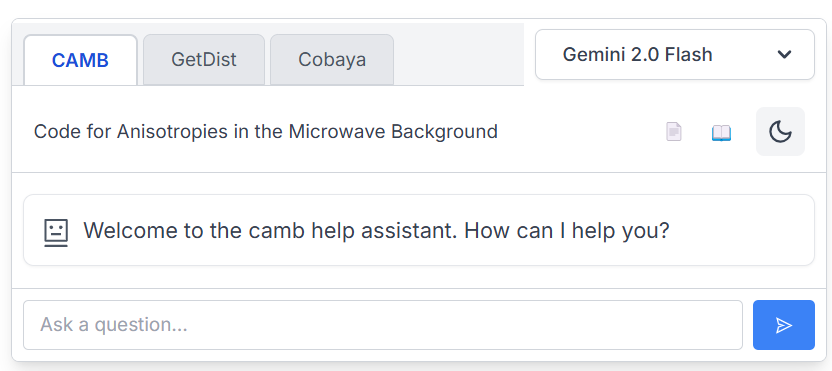

# Full-Context Help Assistant

This application provides an interactive help assistant for technical documentation. It's designed to provide accurate answers by sending the full documentation context to the AI model. The example implementation focuses on cosmology tools (CAMB, GetDist, and Cobaya), but the framework can be adapted for any technical documentation.


*Screenshot of the Help Assistant interface showing the CAMB, GetDist, and Cobaya tabs with model selection*

Key features:

* Support for multiple tools/documentation sets with a tab interface
* Full context documentation for accurate answers without RAG
* Multiple AI model options (OpenAI, Gemini, OpenRouter, etc.)
* Streaming responses for real-time feedback
* Cancellable requests

This application was built using NextJS + ReactJS + TypeScript and supports multiple AI providers through a unified API interface.

## Configuration Options

This application supports multiple AI providers and models through a unified API interface:

### Supported AI Providers

1. **OpenAI Models**
   - Uses the OpenAI Chat Completions API with full context documentation
   - Models: `gpt-4.1-mini-2025-04-14`, `o4-mini`, etc.

2. **Gemini Models**
   - Supports Google's Gemini models through the OpenAI-compatible API
   - Available models: flash and Pro

3. **OpenRouter**
   - Provides access to a wide range of models through a unified API
   - Includes models like DeepSeek, Claude, and others, where context large enough for use case

### Important Note on Context Length

When selecting models, ensure they have sufficient context length to handle your entire documentation. The full-context approach requires models that can process large amounts of text (typically 100K+ tokens). Models with insufficient context length will not be able to process the entire documentation, resulting in incomplete or inaccurate responses.

Recommended minimum context lengths:
- For small documentation: 16K tokens
- For medium documentation: 32K tokens
- For large documentation: 128K+ tokens

You can switch between models in the UI based on your needs for speed, accuracy, and context length capacity.

## Running the Application

1. Ensure you have Node.js installed
2. Clone this repository
3. Install dependencies:
   ```
   npm install
   ```
4. Configure your API keys as environment variables:
   ```
   # For OpenAI
   export OPENAI_API_KEY='your-openai-api-key-here'

   # For Gemini
   export GEMINI_API_KEY='your-gemini-api-key-here'

   # For OpenRouter
   export OPEN_ROUTER_KEY='your-openrouter-api-key-here'

   # For other providers as needed
   export SAMBA_NOVA_API_KEY='your-sambanova-api-key-here'
   ```

   Note: Only configure the API keys for the providers you plan to use.
5. Build the context files:
   ```
   node scripts/build-context.js && node scripts/generate-context-module.js
   ```
6. Run the development server:
   ```
   npm run dev
   ```
7. Open [http://localhost:3000](http://localhost:3000) in your browser

This can all be done automatically using e.g. vercel to host, building on a github push trigger.

## Customizing the Application

### Adding New Documentation Sets

To add support for additional documentation sets:

1. Update the configuration in `config.json` by adding a new entry to the `programs` array:
   ```json
   {
     "id": "your-program-id",
     "name": "Your Program Name",
     "description": "Description of your program",
     "contextFiles": ["your-program-docs.md", "your-program-examples.md"],
     "combinedContextFile": "your-program-combined.md",
     "docsUrl": "https://your-program-documentation-url/",
     "extraSystemPrompt": "Additional instructions for the AI when answering about your program."
   }
   ```

2. Add documentation files for your program in the `context` directory (e.g., `context/your-program-docs.md`)

3. Run the build scripts to generate the combined context files:
   ```
   node scripts/build-context.js && node scripts/generate-context-module.js
   ```

4. Ensure your documentation size is appropriate for the models you plan to use. If your documentation is large, you may need to split it into multiple files or use models with larger context windows.

### Modifying the UI

The UI components are located in the `app/ui` directory. Key components:

- `chat-container.tsx`: Main container that handles program selection and model selection
- `program-tabs.tsx`: Tab interface for switching between different documentation sets
- `chat-simple.tsx`: Implementation of the chat interface with streaming and cancellation support
- `model-selector.tsx`: UI for selecting different AI models

### Adding New Models

To add support for additional AI models:

1. Update the configuration in `config.json` by adding a new entry to the `availableModels` array:
   ```json
   {
     "id": "provider/model-name",
     "name": "Display Name",
     "description": "Description of the model",
     "options": {
       "temperature": 0.7,
       "max_completion_tokens": 4096,
       "stream": true
     }
   }
   ```

2. If adding a new provider, update the `PROVIDER_CONFIGS` in `app/utils/unified-client.ts` to include the new provider configuration.

### Deployment

This application can be deployed to Vercel with minimal configuration:

1. Connect your GitHub repository to Vercel
2. Configure the environment variables for your API keys
3. Deploy the application

The build process will automatically generate the combined context files during deployment.

## Learn More

### Full-Context vs. RAG Approach

This application uses a full-context approach to AI assistance, sending the entire documentation as context to the AI model rather than using RAG (Retrieval Augmented Generation). This approach has several advantages:

- **Accuracy**: The AI has access to the complete documentation, ensuring more accurate and consistent responses
- **Coherence**: Responses maintain coherence across the entire knowledge base
- **Simplicity**: No need for vector databases, embeddings, or complex retrieval systems
- **Reliability**: Less prone to retrieval errors or hallucinations when information is missing

This approach is particularly effective for specialized technical domains where precision is critical. However, it requires models with sufficient context length to handle the entire documentation.

### Performance Considerations

- **Context Size**: Monitor the size of your documentation to ensure it fits within the model's context window
- **Token Usage**: Larger contexts consume more tokens, which may affect costs when using paid API services
- **Response Time**: Models with larger contexts may have slightly longer response times

### Alternative Approaches

If your documentation is too large for even the largest context windows, consider:

1. **Hybrid Approach**: Use RAG for the initial retrieval, then provide the relevant sections as context
2. **Documentation Splitting**: Split your documentation into logical sections and provide a navigation interface
3. **Specialized Models**: Train specialized models for different sections of your documentation
